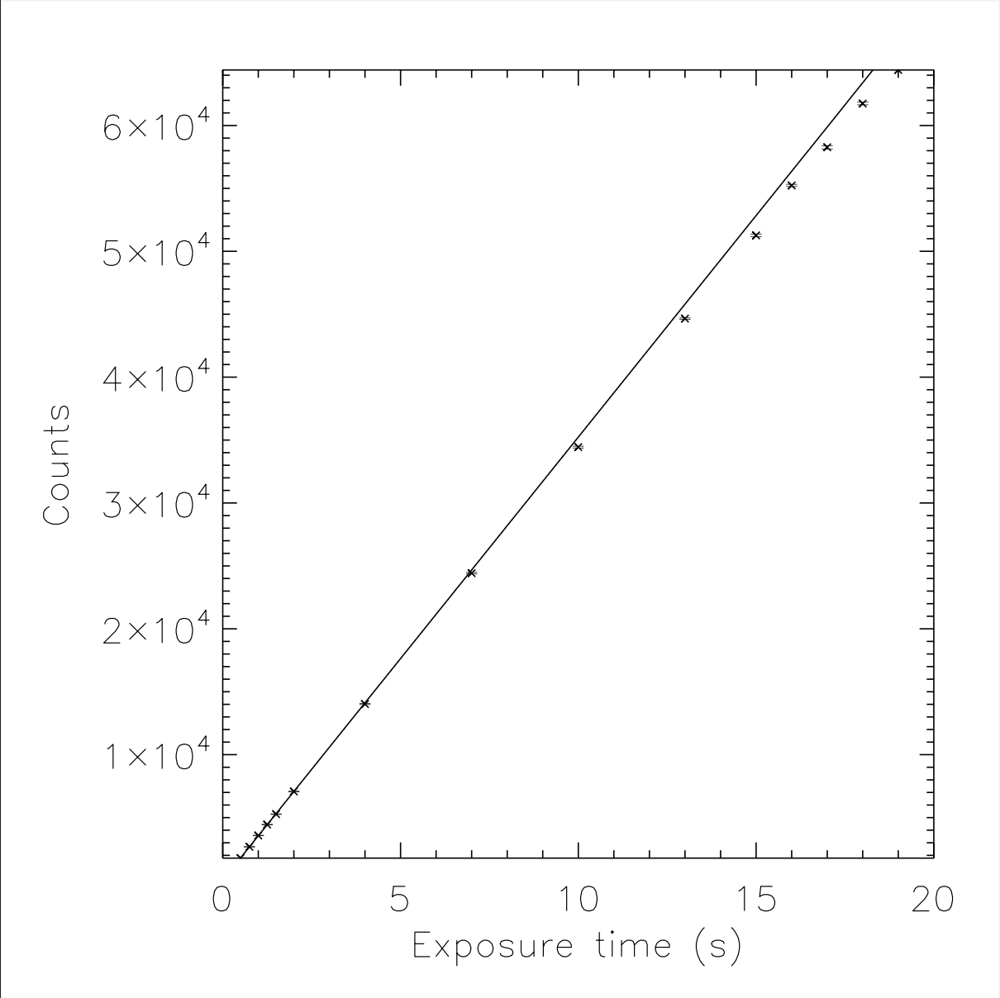
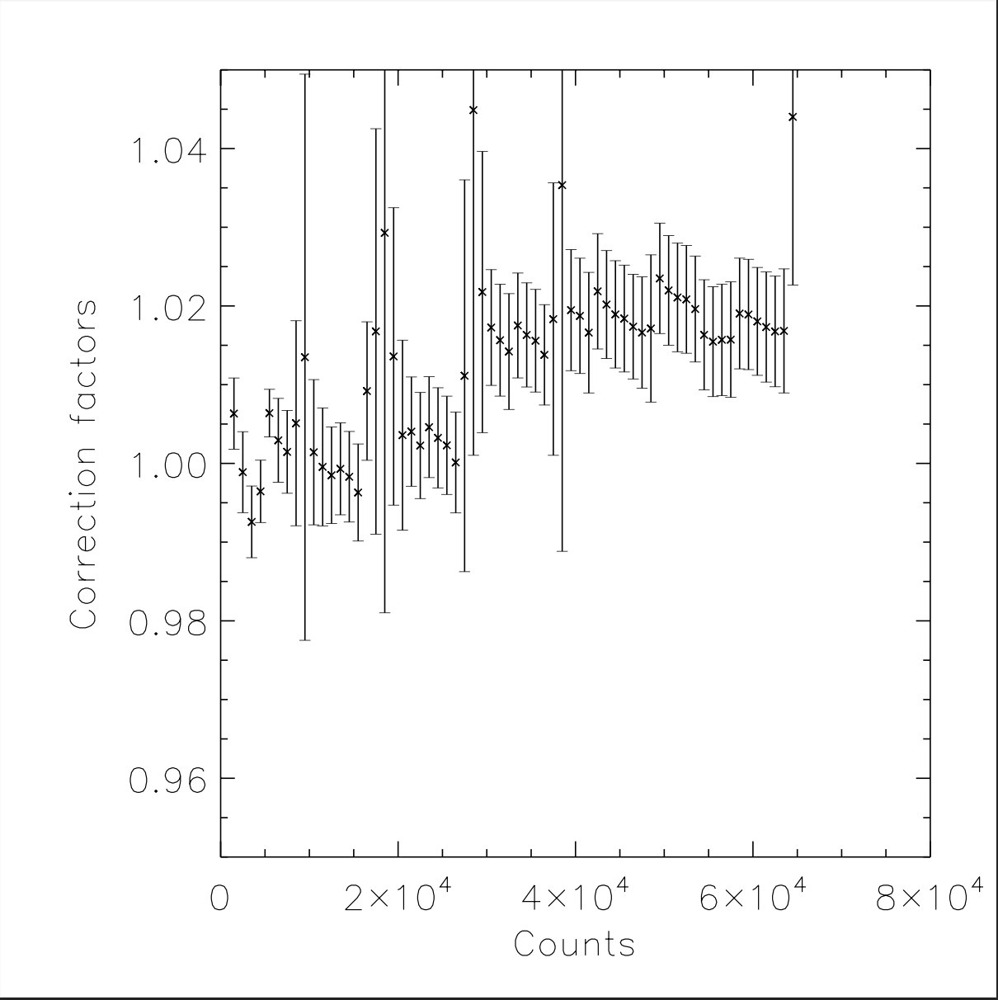
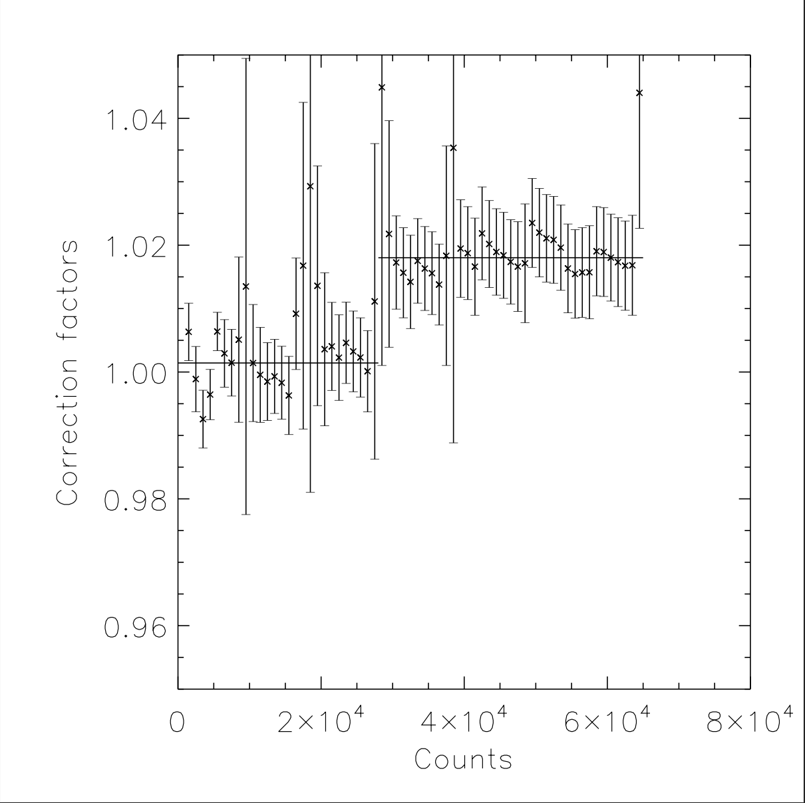

# Introduction

In theory, we would expect the signal received from a given camera to be linearly correlated with its exposure time, i.e. the longer the camera is exposed to light, the stronger the detected signal. However, due to certain underlying physical limitations, this relationship tends to divert from linearity as the sensor approaches its saturation limit.

We know precisely the saturation limit for the CCD camera in the Fredonia observatory - 65,535 counts. Hence, the goal of this project is to create a linearity correction calibration procedure that can be applied to all science images taken using the camera.

# Results

After taking a sequence of images with increasing exposure times of a constant light source, we established a linearity baseline using the data at low exposures, as we're confident the camera is linear at such low counts.

Then, we computed the correction factors by dividing the expected counts from the linear fit with the measured counts from the images.

Notice from the figure below, the correction factors for our telescope's camera range from 2 - 4%, even at higher exposures, indicating that the camera is remarkably linear even as it approaches saturation. It's useful to note that even if we didn't provide any corrections for future images, the error would only be on the order of a few percent.

Finally, using polynomial regression, we determined an optimal linearity correction of a constant offset with a break point at 28000 counts, as it coincided with a minimum reduced chi-squared of 0.309. In other words, if a pixel has counts below 28000, we increase it by 0.1%, whereas if it's at or above 28000, we increase it by 1.8%. 

# Acknowledgements

This work was funded by the Fredonia Summer Research and Creativity Grant.

*_detailed documentation of this work can be found in `Yek_Dunham_2020.pdf`; relevant scripts can be found in `src/`; raw data available upon request._
